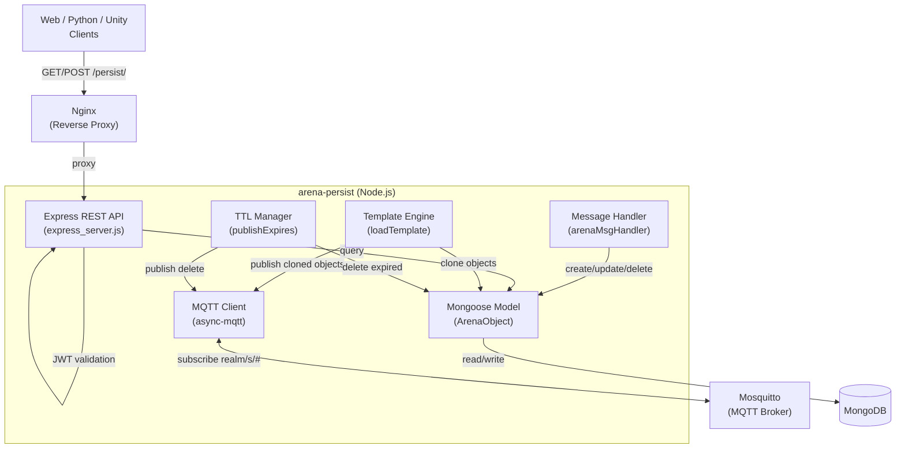
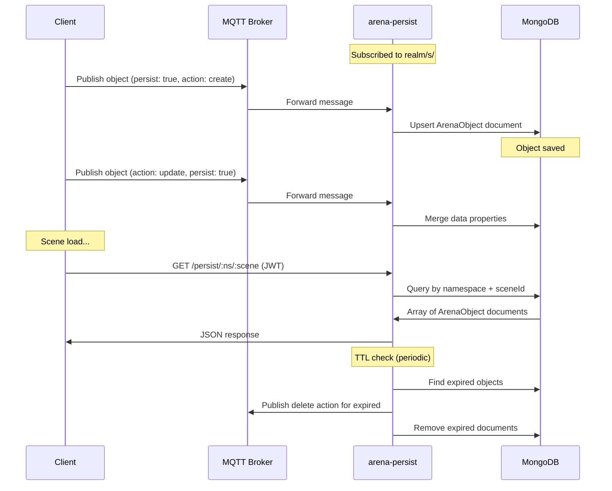

# ARENA Persist — Requirements & Architecture

> **Purpose**: Machine- and human-readable reference for the ARENA persistence service's features, architecture, and source layout.

## Architecture

## Source File Index

| File | Role | Key Symbols |
|------|------|-------------|
| [server.js](server.js) | Main entry: MQTT client, Mongoose schema, message routing | `arenaMsgHandler`, `handleGetPersist`, `handleLoadTemplate`, `createArenaObj`, `loadTemplate`, `publishExpires`, `runMQTT`, `updatePersists` |
| [express_server.js](express_server.js) | REST API with JWT auth middleware | `runExpress`, `checkJWTSubs`, `checkJWTPubs`, `matchJWT`, `checkTokenRights` |
| [topics.js](topics.js) | MQTT topic patterns and parsing | `TOPICS` |
| [utils.js](utils.js) | Utility functions | `asyncForEach`, `asyncMapForEach`, `filterNulls`, `flatten` |
| [config.json](config.json) | Configuration (MongoDB URI, MQTT settings) | `mongodb.uri`, `mqtt.uri` |

## Feature Requirements

### Object Persistence

| ID | Requirement | Source |
|----|-------------|--------|
| REQ-PS-001 | Save objects with `action: create` + `persist: true` to MongoDB | [server.js#arenaMsgHandler](server.js) |
| REQ-PS-002 | Replace existing object entirely on re-create | [server.js#arenaMsgHandler](server.js) |
| REQ-PS-003 | Merge `data` properties on `action: update` + `persist: true` | [server.js#arenaMsgHandler](server.js) |
| REQ-PS-004 | Full data replacement on `update` with `overwrite: true` | [server.js#arenaMsgHandler](server.js) |
| REQ-PS-005 | Skip persistence on `update` with explicit `persist: false` | [server.js#arenaMsgHandler](server.js) |
| REQ-PS-006 | Delete object on `action: delete` | [server.js#arenaMsgHandler](server.js) |

### TTL (Time-to-Live)

| ID | Requirement | Source |
|----|-------------|--------|
| REQ-PS-010 | Objects with `ttl` (float seconds) auto-expire after set duration | [server.js#publishExpires](server.js) |
| REQ-PS-011 | Publish `delete` action over MQTT on TTL expiry | [server.js#publishExpires](server.js) |
| REQ-PS-012 | `ttl` implies `persist: true` | [server.js#arenaMsgHandler](server.js) |

### Templates / Cloning

| ID | Requirement | Source |
|----|-------------|--------|
| REQ-PS-020 | Clone all objects from source scene into target scene | [server.js#loadTemplate](server.js) |
| REQ-PS-021 | Create parent container: `templateNamespace\|templateSceneId::instanceId` | [server.js#loadTemplate](server.js) |
| REQ-PS-022 | Prefix child objects: `templateNamespace\|templateSceneId::instanceId::objectId` | [server.js#loadTemplate](server.js) |
| REQ-PS-023 | Support `position`, `rotation`, `scale`, `parent` on template container | [server.js#loadTemplate](server.js) |
| REQ-PS-024 | Fail if source scene is empty or instanceId already exists in target | [server.js#loadTemplate](server.js) |

### REST API

| ID | Requirement | Source |
|----|-------------|--------|
| REQ-PS-030 | `GET /persist/:namespace/:sceneId` — fetch all persisted objects (JWT sub-check) | [express_server.js#runExpress](express_server.js) |
| REQ-PS-031 | `POST /persist/:namespace/:sceneId` with `action: clone` — clone template (JWT pub-check) | [express_server.js#runExpress](express_server.js) |
| REQ-PS-032 | JWT validation using RS256 and JWK from arena-account | [express_server.js#checkTokenRights](express_server.js) |
| REQ-PS-033 | Topic-based authorization: match JWT claims against request path | [express_server.js#matchJWT](express_server.js) |

### MQTT Operations

| ID | Requirement | Source |
|----|-------------|--------|
| REQ-PS-040 | Subscribe to `realm/s/#` for all scene messages | [server.js#runMQTT](server.js) |
| REQ-PS-041 | Respond to `getPersist` action: return full scene state over MQTT | [server.js#handleGetPersist](server.js) |
| REQ-PS-042 | Periodically refresh persisted object set (hourly) | [server.js#updatePersists](server.js) |

## Persist Flow

## Planned / Future

- Batch operations for bulk object creation
- Scene snapshot / versioning
- Improved template composition (nested templates)
